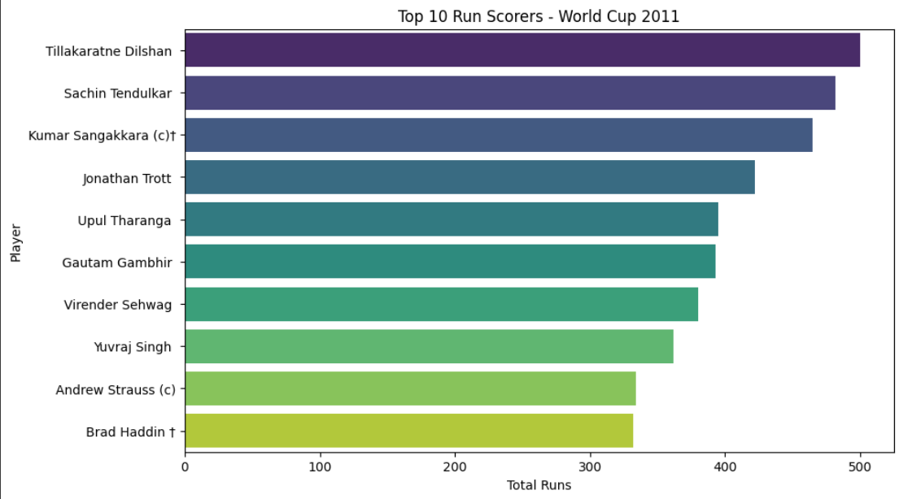

:
________________________________________
🏏 Cricket World Cup 2011 – Batting Analysis (Web Scraping + Visualization)

📌 Overview
This project scrapes ICC World Cup 2011 batting data from Cricbuzz using Python 🐍, cleans the dataset, and performs analysis to uncover interesting insights such as:
•	🥇 Top run scorers
•	⚡ Best strike rates
•	💥 Most sixes & boundaries
•	👤 Player-wise performance summaries
It also includes data visualizations built with Python (Matplotlib/Seaborn) 📊 and an interactive Power BI dashboard 📈.
________________________________________
📂 Project Structure
├── data/
│   ├── WorldCup_11_batting_data.csv     
├── scripts/
│   ├── Cricket.py                        
├── notebooks/
│   ├── cricket_analysis.ipynb            
├── visualizations/
│   ├── cricket_power_bi.pbix             
└── README.md                             # Documentation
________________________________________

📊 Features
✅ Web Scraping – Extract player stats directly from Cricbuzz
✅ Data Cleaning – Handle missing values, convert datatypes
✅ Exploratory Data Analysis (EDA)
✅ Visualizations with Matplotlib & Seaborn:
•	🏆 Top 10 run scorers
•	⚡ Best strike rates
•	💥 Most sixes & boundaries
•	🎯 Strike Rate vs Runs scatter plots
✅ Interactive Dashboard – Power BI for deep dive analysis
________________________________________
📸 Screenshots

### 📊 Player-wise Performance

### 📈 Strike Rate vs Runs

 
 

 

Observations 
1.  Top Run Scorers
•	The first chart highlighted the leading run scorers.
•	Brendon McCullum, Virender Sehwag, and Ross Taylor stood out with consistent contributions.
•	These players formed the backbone of their batting line-ups by scoring heavily over many matches.
2. Best Strike Rates (Minimum 50 Balls)
•	The second chart focused on strike rate efficiency, i.e., how quickly players scored runs.
•	Steven Smith had the highest strike rate (~155), followed by Jacob Oram and Nuwan Kulasekara.
•	Power hitters like Shahid Afridi, Virender Sehwag, and Brendon McCullum also featured, showing their aggressive batting style.
3.  Key Insight
•	High run scorers and high strike rate players are not always the same.
•	Some players (e.g., McCullum, Sehwag) appear in both lists, meaning they could score both big and fast.
•	Others (e.g., Steven Smith, Afridi) may not have the most runs overall but were extremely effective in quick scoring.

________________________________________
🚀 Future Improvements
•	🔄 Automate scraping for live World Cup matches
•	🎯 Add bowling & fielding statistics
•	🌐 Build a Streamlit web app for cricket stats
•	☁️ Deploy dashboards online for easy access
________________________________________

🙌 Contributors
👨‍💻 Utkarsh Sanre – Web Scraping, Data Analysis, Visualization, Documentation
Email – Utkarshsanre449@gmail.com

